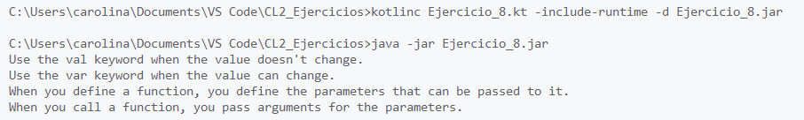
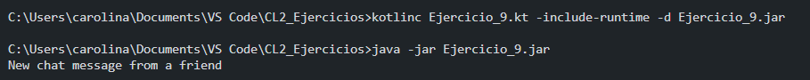
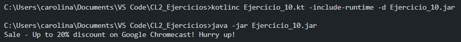
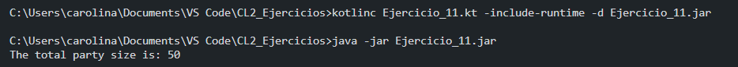
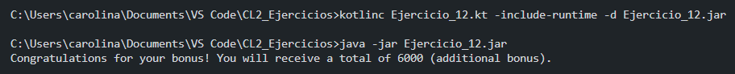
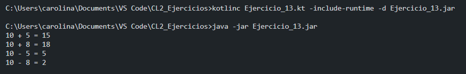
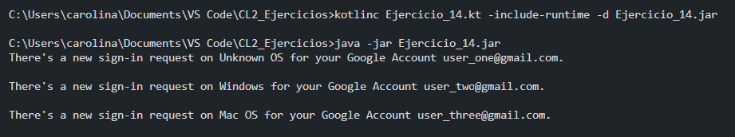
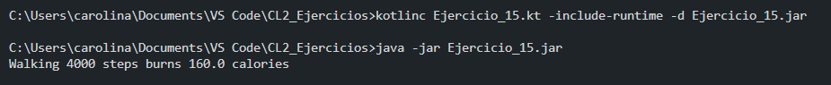
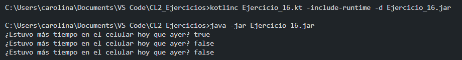
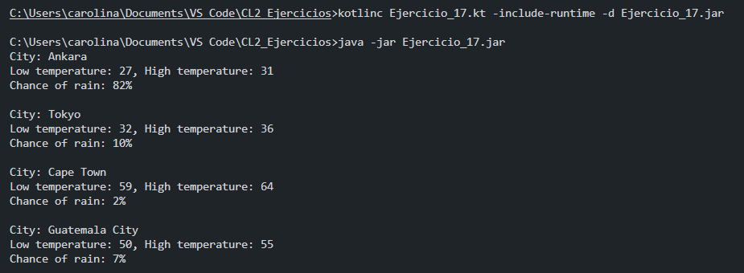

# CODELAB 2: INTRODUCCIÓN A KOTLIN

## LISTA DE EJERCICIOS 1:
- Ejercicio 1
  

- Ejercicio 2
  

- Ejercicio 3
  

- Ejercicio 4
  

- Ejercicio 5
  

- Ejercicio 6
  

- Ejercicio 7
  

## LISTA DE EJERCICIOS 2:

- Ejercicio 8
  

- Ejercicio 9
  

- Ejercicio 10
  

- Ejercicio 11
  

- Ejercicio 12
  

- Ejercicio 13
  

- Ejercicio 14
  

- Ejercicio 15
  

- Ejercicio 16
  

- Ejercicio 17
  